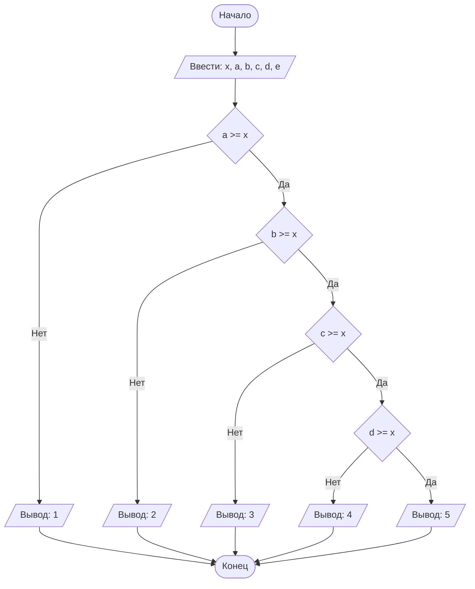

## Отчет по лабораторной работе № 1

#### № группы: `ПМ-2502`

#### Выполнил: `Полянский Илья Сергеевич`

#### Вариант: `15`

### Cодержание:

- [Постановка задачи](#1-постановка-задачи)
- [Входные и выходные данные](#2-входные-и-выходные-данные)
- [Выбор структуры данных](#3-выбор-структуры-данных)
- [Алгоритм](#4-алгоритм)
- [Программа](#5-программа)
- [Анализ правильности решения](#6-анализ-правильности-решения)

### 1. Постановка задачи

> Набор из пяти доминошек с высотами *A, B, C, D, E* устанавливают на
> расстоянии *X* друг от друга в указанном порядке. После этого крайнюю
> доминошку (высоты A) роняют в направлении других доминошек. Какое
> количество доминошек упадет в результате? Считать, что доминошки имеют
> нулевую толщину и что доминошка упадет, если её коснется предыдущая.
> На вход программы подаются натуральные числа *X, A, B, C, D, E*.

Для решения данной задачи мы сравниваем высоту доминошки с расстоянием до следующей доминошки.

Всего для решения задачи необходимо сделать до четырех сравнений,
для каждого из которых будет два случая

1. `A >= X`
2. `B >= X`, если выполняется первое
3. `C >= X`, если выполняется первое и второе
4. `D >= X`, если выполняется первое, второе и третье

### 2. Входные и выходные данные

#### Данные на вход

На вход программа должна получать 6 натуральных чисел. Верхняя же граница получаемых чисел не дана, 
поэтому будет считать ее равной ограничениям типа int.

|             | Тип         | min значение | max значение     |
|-------------|-------------|--------------|------------------|
| X (Число 1) | Целое число | 1            | 2<sup>31</sup>-1 |
| A (Число 2) | Целое число | 1            | 2<sup>31</sup>-1 |
| B (Число 1) | Целое число | 1            | 2<sup>31</sup>-1 |
| C (Число 2) | Целое число | 1            | 2<sup>31</sup>-1 |
| D (Число 1) | Целое число | 1            | 2<sup>31</sup>-1 |
| E (Число 2) | Целое число | 1            | 2<sup>31</sup>-1 |


#### Данные на выход

Т.к. программа должна вывести количество упавших доминошек, то на выход мы получим
единственное целое неотрицательное число, не превышающее количество доминошек (5).

|         | Тип         | min значение | max значение |
|---------|-------------|--------------|--------------|
| Число 1 | Целое число | 1            | 5            |

### 3. Выбор структуры данных

Программа получает 6 натуральных чисел.
Одно из чисел не используется, так как от высоты последней доминошки нечего не зависит, и его можно не хранить
(однако на вход оно подается по условию поэтому мы его все равно получаем)
и выделить только 5 переменных `x`, `a`, `b`, `c`, `d` типа `int`.
Число `E` у нас никак не используется, потому что у нас всего пять доминошек 
и больше этого количества упасть не может. Однако по условию задачи она подается на вход, поэтому я все р

|             | название переменной | Тип (в Java) | 
|-------------|---------------------|--------------|
| X (Число 1) | `x`                 | `int`        |
| A (Число 2) | `a`                 | `int`        | 
| B (Число 3) | `b`                 | `int`        |
| C (Число 4) | `c`                 | `int`        | 
| D (Число 5) | `d`                 | `int`        |
| E (Число 6) |                     |              | 

Для вывода результата необязательно его хранить в отдельной переменной.

### 4. Алгоритм

#### Алгоритм выполнения программы:

1. **Ввод данных:**  
   Программа считывает шесть натуральных чисел, обозначенные как `x`, `a`, `b`, `c`, `d` и `e`.

2. **Сравнение чисел:**  
   - Программа сравнивает значения `a` и `x`. Если `a` больше или равно `x`, программа переходит к следующему сравнению 
   с `x`. Если `x` больше, программа выводит `1`, так как упала только первая доминошка, и завершает работу.
   - Программа сравнивает значения `b` и `x`. Если `a` больше или равно `x`, программа переходит к следующему сравнению
   с `x`. Если `x` больше, программа выводит `2` и завершает работу.
   - Программа сравнивает значения `c` и `x`. Если `a` больше или равно `x`, программа переходит к следующему сравнению
   с `x`. Если `x` больше, программа выводит `3` и завершает работу.
   - Программа сравнивает значения `d` и `x`. Если `a` больше или равно `x`, программа выводит число `5`. Если `x` больше, программа выводит `4` и завершает работу.

#### Блок-схема


### 5. Программа

```java
import java.io.PrintStream;
import java.util.Scanner;

public class Main {
    // Объявляем объект класса Scanner для ввода данных
    public static Scanner in = new Scanner(System.in);
    // Объявляем объект класса PrintStream для вывода данных
    public static PrintStream out = System.out;

    public static void main(String[] args) {
        // Считывание целых чисел x, a, b, c, d, e в консоли
        int x = in.nextInt();
        int a = in.nextInt();
        int b = in.nextInt();
        int c = in.nextInt();
        int d = in.nextInt();
        // От высоты последней доминошки ничего не зависит, поэтому мы ее не сохраняем.
        in.nextInt();

        // Определение количества упавших доминошек
        if (a >= x) {
            // Если первая доминошка коснется следующией, то делаем такую же проверку для второй.
            // Иначе выводим количество упавших доминошек (1)
            if (b >= x) {
                // Если вторая доминошка коснется следующией, то делаем такую же проверку для третьей.
                // Иначе выводим количество упавших доминошек (2)
                if (c >= x) {
                    // Если третья доминошка коснется следующией, то делаем такую же проверку для четвертой).
                    // Иначе выводим количество упавших доминошек (3)
                    if (d >= x) {
                        // Если четвертая доминошка коснется следующией, то выводим количество упавших доминошек (5).
                        // Иначе выводим количество упавших доминошек (4)
                        out.println(5);
                    }
                    else {
                        out.println(4);
                    }
                }
                else {
                    out.println(3);
                }
            }
            else {
                out.println(2);
            }
        }
        else {
            out.println(1);  // Первая доминошка падает всегда
        }
    }
}
```

### 6. Анализ правильности решения

Программа работает корректно на всем множестве решений с учетом ограничений.

1. Тест на `X > A`:

    - **Input**:
        ```
        3 2 4 5 6 7
        ```

    - **Output**:
        ```
        1
        ```
2. Тест на `X <= A, X > B`:

    - **Input**:
        ```
        10 11 2 5 5 1
        ```

    - **Output**:
        ```
        2
        ```

3. Тест на `X <= A, X <= B, X > C`:

    - **Input**:
        ```
        5 9 6 4 11 1
        ```

    - **Output**:
        ```
        3
        ```

4. Тест на `X <= A, X <= B, X <= C, X > D`:

    - **Input**:
        ```
        9 23 24 11 1 11
        ```

    - **Output**:
        ```
        4
        ```
5. Тест на `X <= A, X <= B, X <= C, X <= D`:

    - **Input**:
        ```
        2 2 2 2 2 2
        ```

    - **Output**:
        ```
        5
        ```

